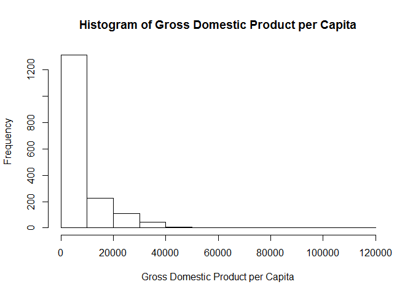

## Overview
The following sections will demonstrate exploratory data analysis in R. We will start by familiziarizing ourselves with the *gapminder* dataset, and then produce a few plots to visualize interesting patterns in the data.

## Get familiar with the data

### Load the dataset

```r
library(gapminder)
```

```
## Warning: package 'gapminder' was built under R version 3.5.1
```

### Explore its structure
The "str" function provides detailed information on the type and composition of the dataset:

```r
str(gapminder)
```

```
## Classes 'tbl_df', 'tbl' and 'data.frame':	1704 obs. of  6 variables:
##  $ country  : Factor w/ 142 levels "Afghanistan",..: 1 1 1 1 1 1 1 1 1 1 ...
##  $ continent: Factor w/ 5 levels "Africa","Americas",..: 3 3 3 3 3 3 3 3 3 3 ...
##  $ year     : int  1952 1957 1962 1967 1972 1977 1982 1987 1992 1997 ...
##  $ lifeExp  : num  28.8 30.3 32 34 36.1 ...
##  $ pop      : int  8425333 9240934 10267083 11537966 13079460 14880372 12881816 13867957 16317921 22227415 ...
##  $ gdpPercap: num  779 821 853 836 740 ...
```
We can see that the dataset has 6 fields (or "variables"), with 1704 entries (or "observations"). Some of these contain numerical data and others contain text data.

### Look under the hood
We can get a better sense of what we are working with by using the "head" function:


```r
head(gapminder)
```

```
## # A tibble: 6 x 6
##   country     continent  year lifeExp      pop gdpPercap
##   <fct>       <fct>     <int>   <dbl>    <int>     <dbl>
## 1 Afghanistan Asia       1952    28.8  8425333      779.
## 2 Afghanistan Asia       1957    30.3  9240934      821.
## 3 Afghanistan Asia       1962    32.0 10267083      853.
## 4 Afghanistan Asia       1967    34.0 11537966      836.
## 5 Afghanistan Asia       1972    36.1 13079460      740.
## 6 Afghanistan Asia       1977    38.4 14880372      786.
```
This shows the first 6 records in each of the fields, providing a "sneak peak" of the data without overwhelming us with the entire dataset.

### Summarize the data
Let's conduct a basic analysis of the gapminder dataset. The "summary" function provides a number of descriptive statistics for each field:


```r
summary(gapminder)
```

```
##         country        continent        year         lifeExp     
##  Afghanistan:  12   Africa  :624   Min.   :1952   Min.   :23.60  
##  Albania    :  12   Americas:300   1st Qu.:1966   1st Qu.:48.20  
##  Algeria    :  12   Asia    :396   Median :1980   Median :60.71  
##  Angola     :  12   Europe  :360   Mean   :1980   Mean   :59.47  
##  Argentina  :  12   Oceania : 24   3rd Qu.:1993   3rd Qu.:70.85  
##  Australia  :  12                  Max.   :2007   Max.   :82.60  
##  (Other)    :1632                                                
##       pop              gdpPercap       
##  Min.   :6.001e+04   Min.   :   241.2  
##  1st Qu.:2.794e+06   1st Qu.:  1202.1  
##  Median :7.024e+06   Median :  3531.8  
##  Mean   :2.960e+07   Mean   :  7215.3  
##  3rd Qu.:1.959e+07   3rd Qu.:  9325.5  
##  Max.   :1.319e+09   Max.   :113523.1  
## 
```
Here we can clearly see that we are working with demographic information from a number of years and locations. Already we can identify some interesting information:

- The temporal coverage of the dataset ranges from 1952 to 2007. 
- Life expectany ranges from 23.60 to 82.60 years
- Population ranges from 60,010 to 1,319,000,000
- Gross Domestic Product per Capita (gdpPercap) ranges from 241.2 to 113523.1 (although we are unsure of the currency)

## Explore GDP

Let's use the gapminder dataset to look at inequality. Using the information from the summary function above, we can divide the maximum GDP by the minimum GDP:

```r
113523.1/241.2
```

```
## [1] 470.6596
```
Here we see that across the full range of time from 1952 to 2007, people in the wealthiest countries made 470.7 times as much money as the poorest. 

### Plot a histogram
We can look at the distribution of wealth by using the "hist" function to plot a histogram.
Notice that "xlab" is included to label the x axis.

```r
hist(gapminder$gdpPercap, 
     xlab = "Gross Domestic Product per Capita",
     main = "Histogram of Gross Domestic Product per Capita")
```

<!-- -->

The histogram shows a strong right skew, indicating that from 1957 to 2007, the vast majority of people made less than 20,000, while only a few made more than 40,000.

### Plot GDP through time
Let's use the "plot" function in base R to examine how GDP per capita has changed over time.
Again, we can provide basic labels with "ylab", "xlab", and "main".


```r
plot(gapminder$year,gapminder$gdpPercap, 
     ylab = "GDP per capita", 
     xlab ="Year",
     main = "GDP per capita through time")
```

<!-- -->

Interestingly, the plot indicates that there are no extreme outliers after 1980, and that the range of GDP per capita has been increasingly fairly consistently since the late 1950s.


## Conclusion

The previous exercises show the value of simple data exploration in R. Through simple summary functions and generating simple plots, we are able to rapidly familiarize ourselves with the dataset and generate new questions to ask of it.
